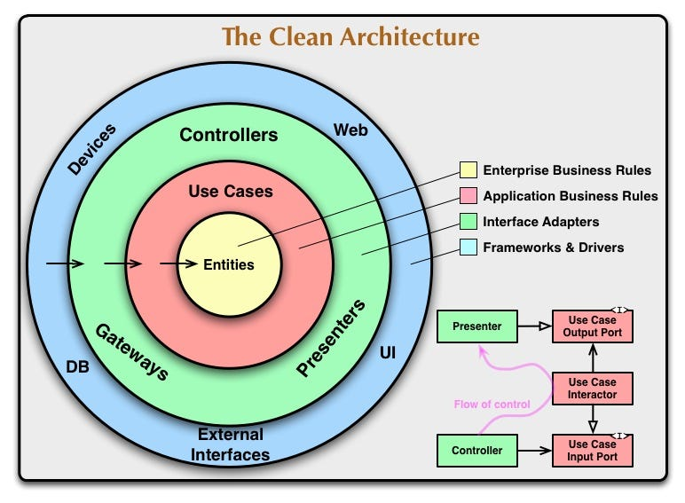

# Inventory demo service

This is a small example of the microservice 'Inventory', which is part of a big architecture. I'm working with clean architecture.

## Inventory Service

## Clean Architecture

